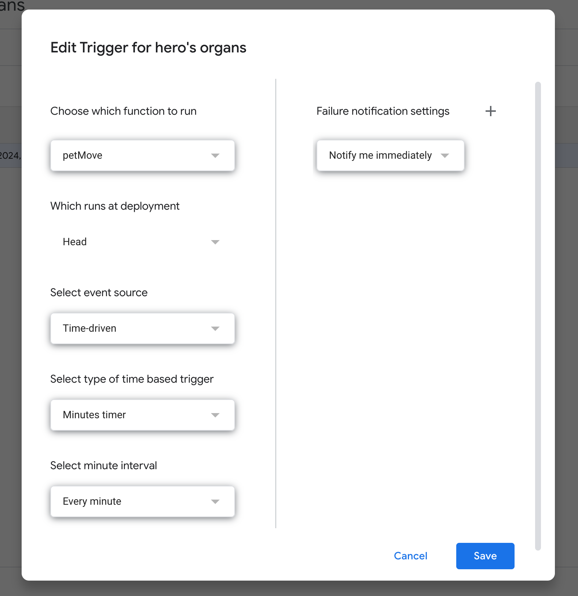
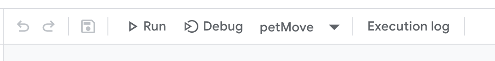

# 🦊 Slidepet
Easily create your own virtual pet, for fun!

---

### Easily Get Started in 21 steps

So you want your own pet.
Here are the steps to get started:

Here’s the revised version of your steps to incorporate the new custom menu process:

---

1. [Create a new Google Slide](https://slides.new).
2. Name it `>: 0` (It’s important to name it exactly this way to start the setup).
3. Close the slide, then re-open it.
4. Once reopened, navigate to the **SlidePet Menu** at the top of the page.
5. Click on the custom menu and select **Each of the Custom Settings**.
6. You will be prompted to enter the following information:
    - **Pet Name**: Enter your pet’s name.
    - **Pet Type**: Choose the type of pet.
    - **Email Notifications**: Set this to **On** or **Off** (True/False).
    - **Email**: Enter your email address for notifications.
7. If you skip this step, the script will error out, so make sure to customize all values before proceeding.
8. Now, in the Navbar, click **Extensions** → **Apps Script**.
9. Paste the contents of `pet.js` into the script editor.
10. It should be clear what needs to be changed. Set `email_notifications` to `true` or `false`, depending on your preference.
11. On the right side of the screen (below the **ⓘ Info Icon**), click **⏰ Triggers**.
12. Then, click **Add Trigger**.
13. Ensure that **Choose which function to run** is set to `petMove`.
14. Change **Select type of time-based trigger** to **Minutes Timer**.
15. Set **Select minute interval** to the speed at which you want your pet to walk.
16. Set **Failure notification settings** to **Immediately**.
    
    *Finished Setup Example*
17. Click **Save**.
18. Click on your Google Account.
19. **If a popup appears**, click **Advanced**, then **Go to Untitled Project (unsafe)**.
20. Click **Allow**.
21. Congratulations! 🎉 Your pet is now up and running. Feel free to decorate your slide with pictures of them!

---

### How to use the Cheat Menu

1. After installing SlidePet, you should simply be able to open the menu at the top labelled `SlidePet`.
**Not Working? Troubleshoot Below:**
1. Click `Extensions` → `Apps Script`.
2. From the top bar, where it says `petMove` change to `onOpen`.

3. Click **Debug**.
4. Traceback the error.
5. Need extra help? Check out the useful links section to report a bug.

---

### Useful Links

- [Report issues/bugs](https://github.com/cabinfvr/slidepet/issues)
- [Pet.js File](https://raw.githubusercontent.com/cabinfvr/slidepet/refs/heads/main/pet.js)